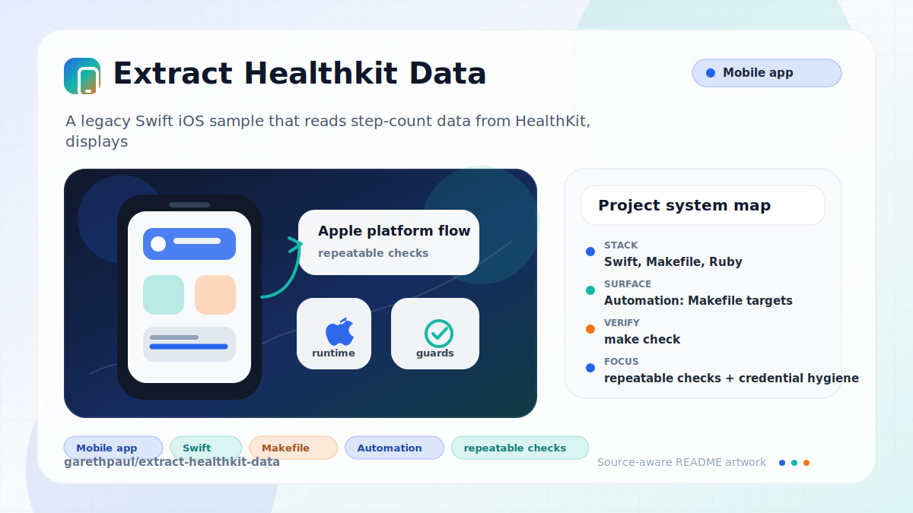

# extract-healthkit-data

<!-- README-OVERVIEW-IMAGE -->


## Overview

`garethpaul/extract-healthkit-data` is a legacy Swift iOS sample that reads
step-count data from HealthKit, displays recent daily totals, and can export
those values to a configured HTTPS endpoint.

HealthKit step data is sensitive. The checked-in baseline requests read-only
step-count access and keeps the export endpoint empty until configured locally.

## Repository Contents

- `Podfile` - Apple platform dependency metadata
- `CHANGES.md` - maintenance history
- `Makefile` - local verification entry points
- `ExtractHealthKit` - source or example code
- `ExtractHealthKit.xcodeproj` - Xcode project file
- `ExtractHealthKitTests` - source or example code
- `Podfile.lock` - Apple platform dependency metadata
- `SECURITY.md` - security reporting and disclosure guidance
- `VISION.md` - project direction and maintenance guardrails

Additional scan context:

- Source directories: ExtractHealthKit, ExtractHealthKitTests
- Dependency and build manifests: Podfile, Podfile.lock
- Entry points or build surfaces: ExtractHealthKit.xcodeproj
- Test-looking files: ExtractHealthKitTests/ExtractHealthKitTests.swift, ExtractHealthKitTests/Info.plist

## Getting Started

### Prerequisites

- Git
- macOS with Xcode for building Apple platform projects
- CocoaPods if dependencies need to be installed
- Python 3 for the static baseline script
- `make`

### Setup

```bash
git clone https://github.com/garethpaul/extract-healthkit-data.git
cd extract-healthkit-data
pod install
```

The setup commands above are derived from repository files. Legacy mobile, Python, or JavaScript samples may require older SDKs or package versions than a modern workstation uses by default.

## Running or Using the Project

- Open `ExtractHealthKit.xcworkspace` after `pod install`, choose the app
  scheme, and run it on a HealthKit-capable device.
- Configure `HealthKitExportEndpoint` in local app metadata with an HTTPS URL
  that includes a host and does not embed username/password userinfo, query
  strings, or fragments before using export. The committed value is
  intentionally empty.
- The app requests read-only step-count access and only exports after the user
  confirms the export alert.
- Export payloads contain `date` and `value` fields for collected step rows;
  no network request is made when there are no step rows to export.
- Export payload construction keeps only rows with valid date/value fields and
  skips the network request if filtering leaves no rows.
- The HealthKit query uses an exact 30-day lookback, and export construction
  inspects at most the same 30 daily rows before rejecting encoded JSON larger
  than 64 KiB or handing data to network code.
- Export requests are only serialized when the payload is one of Foundation's
  valid JSON objects.
- Export requests use a bounded timeout before being handed to Alamofire.
- Each export request disables shared HTTP cookie handling and declares
  `Cache-Control: no-store` before serializing or sending HealthKit data.
- HealthKit authorization and query failures use generic log messages instead
  of raw HealthKit error descriptions.

## Testing and Verification

Run the static maintenance gate:

```bash
make check
```

`make check` validates privacy-sensitive source invariants, HealthKit plist and
entitlement metadata, Podfile lock versions, and Xcode project settings. When
`xcodebuild` is available, it also checks that Xcode can parse the project.

GitHub Actions runs `make check` on a fixed `macos-15` runner for pushes, pull
requests, and manual dispatches. The job pins checkout by commit, uses read-only
repository permissions, does not persist the checkout credential, and exercises
the Xcode project parse without HealthKit
records, endpoint values, credentials, simulators, or devices.

For full verification, run the app on a HealthKit-capable device with test data
you control.

When the required SDK or runtime is unavailable, use static checks and source review first, then verify on a machine that has the matching platform toolchain.

## Configuration and Secrets

- Keep endpoint URLs, API keys, OAuth credentials, tokens, signing material, and
  account-specific values in local configuration only.
- `HealthKitExportEndpoint` is the local HTTPS export endpoint setting. It must
  include a host and must not include embedded username/password userinfo,
  query strings, or fragments. Do not commit a private endpoint value.
- Provisioning profiles, signing certificates, certificate requests, app
  archives, and archive intermediates are ignored and must stay out of source
  control.

## Security and Privacy Notes

- Review changes touching authentication or token handling; examples from the scan include ExtractHealthKit/Request.swift.
- Review changes touching external API calls or credential-adjacent configuration; examples from the scan include ExtractHealthKit/Alamofire.swift.
- Review changes touching network requests, sockets, or service endpoints; examples from the scan include ExtractHealthKit/API.swift, ExtractHealthKit/Alamofire.swift, ExtractHealthKit/Info.plist, ExtractHealthKit/Request.swift, and 3 more.
- Review changes touching mobile permissions or privacy-sensitive device data; examples from the scan include ExtractHealthKit/Alamofire.swift, ExtractHealthKit/Info.plist, ExtractHealthKit/Request.swift, ExtractHealthKit/SwiftyJSON.swift, and 1 more.
- Review changes touching file, media, JSON, XML, CSV, OCR, or data parsing; examples from the scan include ExtractHealthKit/API.swift, ExtractHealthKit/Alamofire.swift, ExtractHealthKit/Info.plist, ExtractHealthKit/SwiftyJSON.swift, and 2 more.
- Do not log, commit, or fixture real HealthKit records. Use synthetic data for
  verification notes and tests.
- Keep HealthKit collection and egress bounded to the shared 30-day limit and
  64 KiB of encoded JSON before a request is queued.

## Maintenance Notes

- This looks like an Apple platform project or sample. Xcode, Swift, CocoaPods, and deployment target versions may need to match the original project era.
- See `SECURITY.md` for vulnerability reporting and safe research guidance.
- See `VISION.md` for project direction and contribution guardrails.
- See `docs/plans/2026-06-08-extract-healthkit-privacy-baseline.md` for the
  current privacy baseline.
- See `docs/plans/2026-06-09-healthkit-empty-export-guard.md` for the
  empty-export guard and payload-shape plan.
- See `docs/plans/2026-06-09-healthkit-endpoint-userinfo-guard.md` for the
  endpoint username/password guard.
- See `docs/plans/2026-06-09-healthkit-endpoint-query-fragment-guard.md` for
  the endpoint query-string and fragment guard.
- See `docs/plans/2026-06-09-healthkit-signing-artifact-guard.md` for the
  signing and archive artifact guard.
- See `docs/plans/2026-06-09-healthkit-json-payload-validation.md` for the
  JSON payload validation guard.
- See `docs/plans/2026-06-09-healthkit-error-logging-guard.md` for the
  HealthKit error logging guard.
- See `docs/plans/2026-06-09-healthkit-export-row-validation.md` for export
  row validation before POST.
- See `docs/plans/2026-06-09-healthkit-export-timeout.md` for bounded export
  request timeout handling.
- See `docs/plans/2026-06-10-healthkit-ci-baseline.md` for the hosted macOS and
  Xcode project-parse baseline.
- See `docs/plans/2026-06-10-healthkit-export-volume-bounds.md` for row and JSON
  byte limits before HealthKit export.
- See `docs/plans/2026-06-12-healthkit-exact-30-day-scope.md` for the shared
  query and export lookback boundary.
- See `docs/plans/2026-06-13-healthkit-request-privacy.md` for outbound cookie
  isolation and non-storage request controls.

## Contributing

Keep changes small and tied to the project that is already present in this repository. For code changes, document the toolchain used, avoid committing generated dependency directories or local configuration, and update this README when setup or verification steps change.
